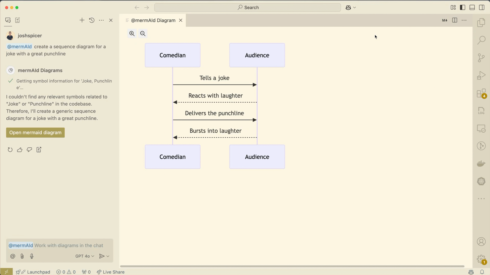

# Description

Collaborate with [GitHub Copilot](https://code.visualstudio.com/docs/copilot/overview) to create [Mermaid](https://mermaid.js.org/intro/) diagrams through the chat participant, `@mermAId`.  

This extension was built in part to demonstrate the power of new GitHub Copilot extension APIs.  Check out the [VS Code Chat Participant API](https://code.visualstudio.com/api/extension-guides/chat) for more info!

[Sign up for a GitHub Copilot free trial](https://github.com/settings/copilot)

## Features

Ask the `@mermAId` chat participant to generate a diagram based on the current open editor. Include slash commands for commonly used diagram types.  Follow the links in the diagram to relevant source code.

Don't have any code? Chat with `@mermAId` to prototype an idea or deepen your knowledge of programming concepts

Iterate on complex diagrams using natural language

Open the "Visual Outline" view to dynamically generate diagrams when swapping between editors.  Break out into chat for finer control.

Export diagrams as markdown to share directly in places that render mermaid (like [GitHub Issues](https://docs.github.com/en/get-started/writing-on-github/working-with-advanced-formatting/creating-diagrams#creating-mermaid-diagrams)).

## Extension Settings

- `mermaid.searchForExtensions`: Search for Mermaid extensions when viewing Mermaid source.
- `mermaid.enableGroq`: **Experimental**: Enable outline generation with [groq](https://groq.com/). Requires an API key from groq.

## Using groq

1. use the command `copilot mermAId: Store groq API key` to add your groq api key
2. go to the outline view and click the refresh button
3. you should be able to see in the mermAId logs that the groq API is set
4. to disable even with the key set use the setting `mermaid.enableGroq`
5. groq API key is store in extension secrets, may not persist always so check if you think there is an issue
